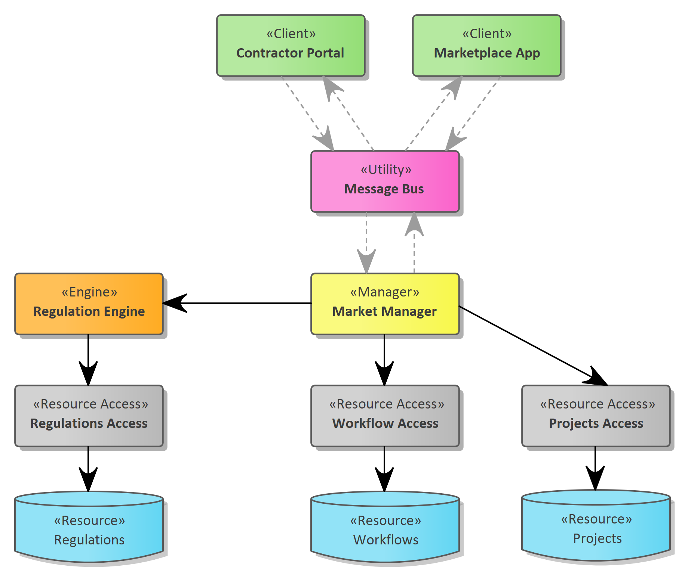

# Restaurant Hours

## Requirements

### By Version

Initial POC, and, if time, follow-on versions

#### POC/MVP/V0.1

|  |  |
| --- | --- |
| **Use Case** |  What restaurants are open at this time? |
| **SLA/KPI** |  N/A |
| **Auth** |  N/A |
| **CI-CD** |  N/A |
| **Deploy Constraints** |  Deployed locally only |
| **Host** | `https://localhost:{TBD}` |
| **GET Endpoint** | `/restaurant/open/{datetime}` |

#### V0.2

Containerize the above via Docker

#### V1.0

|  |  |
| --- | --- |
| **Use Case** |  What restaurants are open at this time? |
| **SLA/KPI** |  N/A |
| **Auth** |  N/A |
| **CI-CD** |  GitHub Actions |
| **Deploy Constraints** |  None |
| **Host** | `https://www.codeonward.com` |
| **GET Endpoint** | `/restaurant/open/{datetime}` |

### Technical Requirements

#### Endpoint

1. The endpoint must accept a datetime string
1. The endpoint must return a list of open restaurants by name
1. The endpoint will return an error to the client if the restaurant name is unrecognized
1. The endpoint will return an error to the client on all other unrecoverable errors

#### Assumptions and Business Rules

1. A restaurant is considered closed if the day-of-week is not included in the data for that restaurant
1. When parsing the given hours of operation, any parsing error will cause the restaurant to be unrecognized
1. Unrecognized restaurants will return an error to the client
1. The data given in CSV format will not have "broken" ranges, e.g. "Mon-Wed 11:00 am - 1pm" with "Mon-Wed 5pm-8pm"
1. The data will never have hours of operation that span midnight

#### Technical Constraints

1. Use python and the python standard library
1. This solution must include testing (of course! Here to be checked off)

## Architecture/Design/Approach

This example solution is using, loosely, the IDesign software methodology.  For more information, see _Righting Software_.

The api router is very thin, and routes to the IDesign managers directly.  Managers only communicate with engines and accessors.  Managers can talk with other managers, but engines and accessors do not talk to other engines.

TODO: update the following with a diagram specific to this solution

One example of IDesign:



### Volatility

The main area of volatility is in the data: the hours a particular restaurant is open.

1. If a set csv of data was a fixed technical requirement, parsing the hours-open into a list of start-end times would happen outside of the main GET request, perhaps with an internal endpoint

2. Even better, an internal endpoint that takes the name of the restaurant with its new open hours would be saved into a database meeting/supporting our non-existent SLAs or KPIs.

### Expediting for the MVP

1. A python library for APIs will be used: Flask
2. The given data in csv format will be parsed on startup into a json format such that each restaurant will have a list of open and closed day-of-week with time

```
{[
  "Caffe Luna": [
    { "Mon": { "Open": "11:00", "Closed": "13:00" }},
    { "Tue": { "Open": "11:00", "Closed": "13:00" }}
  ],
  "Neo": [
    { "Fri": { "Open": "18:00", "Closed": "24:00" }},
    { "Sat": { "Open": "14:00", "Closed": "24:00" }}
  ],
]}
```
